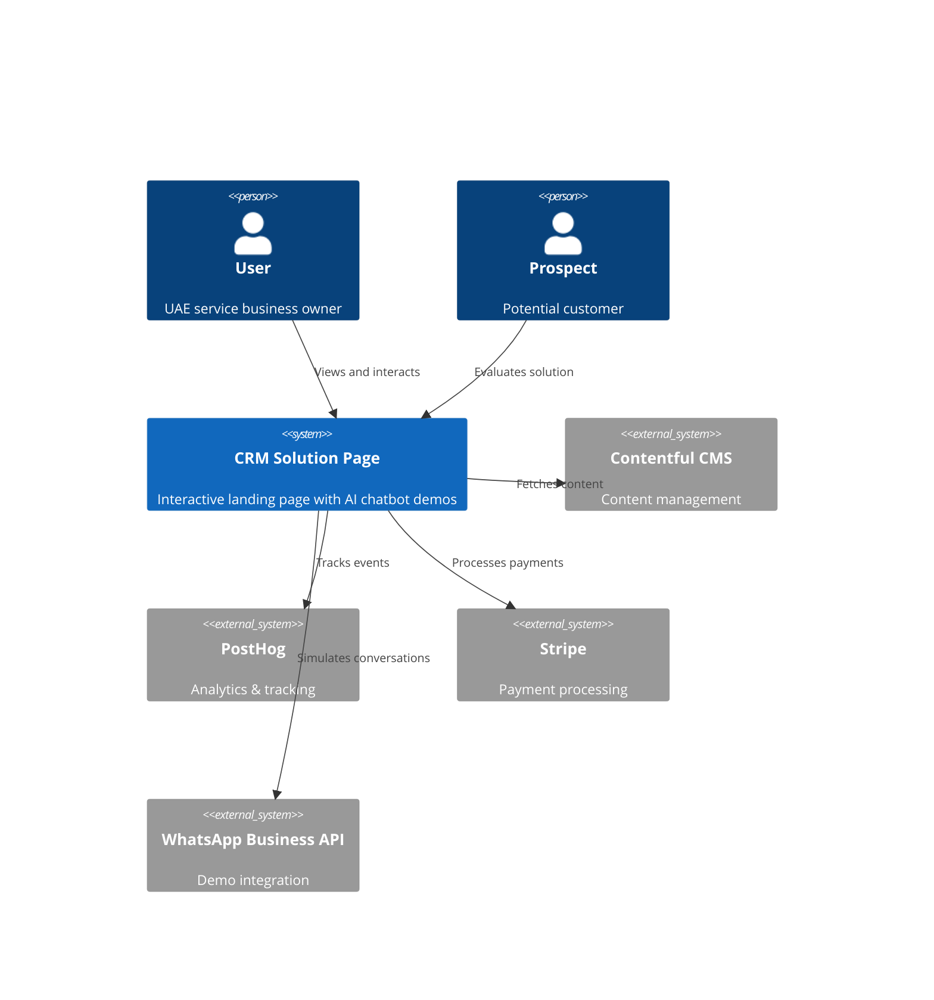
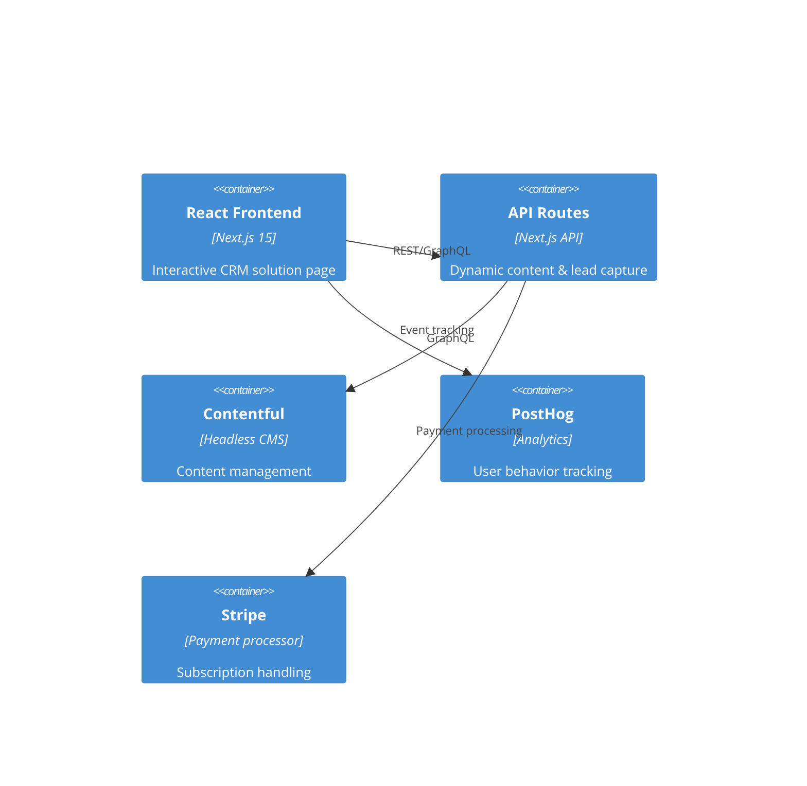

# CRM Solution Page - System Architecture

## Executive Summary

This document outlines a comprehensive architectural redesign for the CRM solution page, transforming a monolithic 1,265-line component into a scalable, maintainable, and performant modular system. The architecture addresses complexity reduction, interactive feature implementation, multilingual support, and performance optimization while maintaining consistency with the existing glassmorphism design system.

## Current State Analysis

### Issues Identified
- **Monolithic Structure**: Single 1,265-line component with poor maintainability
- **No Interactive Features**: Static content lacking ROI calculator, WhatsApp simulator, assessment tools
- **No Multilingual Support**: English-only content limiting UAE market reach
- **Performance Concerns**: Large bundle size and potential layout shifts
- **Limited State Management**: No structured approach for dynamic content
- **No Analytics Integration**: Missing conversion tracking and user behavior analysis

## Architecture Overview

### System Context


### Container Diagram


## Technology Stack

### Frontend Technologies
- **Framework**: Next.js 15 with App Router (existing)
- **UI Library**: React 19 RC (existing)
- **Styling**: Tailwind CSS with glassmorphism utilities (existing)
- **Animation**: Framer Motion with optimized variants
- **State Management**: Zustand for interactive features
- **Forms**: React Hook Form with Zod validation
- **Charts**: Recharts for ROI calculator visualization
- **i18n**: next-intl for multilingual support

### Backend & Data
- **API**: Next.js API routes
- **Database**: PostgreSQL for lead capture and analytics
- **CMS**: Contentful (existing integration)
- **Validation**: Zod schemas for type safety
- **Cache**: Redis for performance optimization

### DevOps & Monitoring
- **Analytics**: PostHog (existing)
- **Performance**: Vercel Speed Insights (existing)
- **Error Tracking**: Sentry integration
- **SEO**: Next.js built-in optimization

## Component Architecture

### High-Level Structure
```
app/services/crm-solution/
├── page.tsx                    # Main page orchestrator (50 lines)
├── components/                 # Feature-specific components
│   ├── hero/
│   │   ├── CRMHero.tsx        # Hero section with video background
│   │   ├── HeroStats.tsx      # Statistics display
│   │   └── HeroCTA.tsx        # Call-to-action buttons
│   ├── interactive/
│   │   ├── ROICalculator.tsx  # Interactive ROI calculation
│   │   ├── WhatsAppSimulator.tsx # Live chat simulation
│   │   ├── AssessmentTool.tsx # Business readiness assessment
│   │   └── DemoBooking.tsx    # Calendar integration
│   ├── features/
│   │   ├── FeatureGrid.tsx    # Main features showcase
│   │   ├── AIShowcase.tsx     # AI chatbot demonstration
│   │   ├── IntegrationHub.tsx # Platform integrations
│   │   └── WorkflowDemo.tsx   # Process visualization
│   ├── social-proof/
│   │   ├── Testimonials.tsx   # Customer success stories
│   │   ├── CaseStudies.tsx    # Detailed use cases
│   │   ├── StatsCounter.tsx   # Achievement metrics
│   │   └── TrustBadges.tsx    # Security & compliance
│   ├── content/
│   │   ├── ComparisonTable.tsx # Before/after comparison
│   │   ├── PricingPlans.tsx   # Subscription options
│   │   ├── FAQ.tsx            # Frequently asked questions
│   │   └── SupportInfo.tsx    # Help & onboarding
│   └── layout/
│       ├── PageLayout.tsx     # Common layout wrapper
│       ├── Section.tsx        # Reusable section component
│       └── Navigation.tsx     # In-page navigation
├── hooks/                     # Custom React hooks
│   ├── useROICalculator.ts    # ROI calculation logic
│   ├── useLanguage.ts         # i18n management
│   ├── useAnalytics.ts        # Event tracking
│   └── useLeadCapture.ts      # Form submission
├── store/                     # Zustand state management
│   ├── calculatorStore.ts     # ROI calculator state
│   ├── simulatorStore.ts      # WhatsApp simulator state
│   └── assessmentStore.ts     # Assessment tool state
├── types/                     # TypeScript definitions
│   ├── crm.types.ts          # CRM-specific types
│   ├── calculator.types.ts   # Calculator interfaces
│   └── i18n.types.ts         # Internationalization types
└── utils/                     # Utility functions
    ├── calculations.ts        # ROI calculation formulas
    ├── validators.ts          # Form validation schemas
    └── constants.ts           # Configuration constants
```

## Component Design Specifications

### 1. CRM Hero Section
**Purpose**: First impression with video background and key value proposition
**Technology**: React + Framer Motion + Cloudinary video optimization
**Props Interface**:
```typescript
interface CRMHeroProps {
  locale: string;
  heroContent: {
    title: string;
    subtitle: string;
    videoUrl: string;
    stats: HeroStat[];
  };
}
```

### 2. Interactive ROI Calculator
**Purpose**: Demonstrate value through personalized calculations
**Technology**: React Hook Form + Recharts + Zustand
**Features**:
- Business size input (employees, monthly leads)
- Current conversion rate assessment
- Expected improvement projections
- Visual charts and cost savings breakdown
- Shareable results via WhatsApp/email

### 3. WhatsApp Simulator
**Purpose**: Live demonstration of AI chatbot capabilities
**Technology**: React + WebSocket simulation + Framer Motion
**Features**:
- Realistic WhatsApp UI mockup
- Predefined conversation flows
- AI response simulation
- Multi-language support (Arabic/English)
- Appointment booking demonstration

### 4. Business Assessment Tool
**Purpose**: Qualify leads while providing value
**Technology**: React Hook Form + conditional logic + lead scoring
**Features**:
- Multi-step questionnaire
- Industry-specific questions
- Readiness scoring algorithm
- Personalized recommendations
- Lead capture with scoring data

## Data Architecture

### Database Schema
```sql
-- Lead capture and scoring
CREATE TABLE leads (
    id UUID PRIMARY KEY DEFAULT gen_random_uuid(),
    email VARCHAR(255) NOT NULL,
    company_name VARCHAR(255),
    industry VARCHAR(100),
    employees_count INTEGER,
    monthly_leads INTEGER,
    current_tools TEXT[],
    pain_points TEXT[],
    assessment_score INTEGER,
    roi_calculation JSONB,
    locale VARCHAR(10) DEFAULT 'en',
    source VARCHAR(50) DEFAULT 'crm-page',
    created_at TIMESTAMP DEFAULT CURRENT_TIMESTAMP,
    updated_at TIMESTAMP DEFAULT CURRENT_TIMESTAMP
);

-- ROI calculations for analytics
CREATE TABLE roi_calculations (
    id UUID PRIMARY KEY DEFAULT gen_random_uuid(),
    lead_id UUID REFERENCES leads(id),
    business_size VARCHAR(50),
    current_conversion_rate DECIMAL(5,2),
    projected_improvement DECIMAL(5,2),
    monthly_savings DECIMAL(10,2),
    yearly_roi DECIMAL(10,2),
    calculation_data JSONB,
    created_at TIMESTAMP DEFAULT CURRENT_TIMESTAMP
);

-- Page interactions for optimization
CREATE TABLE page_interactions (
    id UUID PRIMARY KEY DEFAULT gen_random_uuid(),
    session_id VARCHAR(255),
    component_name VARCHAR(100),
    interaction_type VARCHAR(50),
    interaction_data JSONB,
    timestamp TIMESTAMP DEFAULT CURRENT_TIMESTAMP
);

-- A/B test variations
CREATE TABLE ab_tests (
    id UUID PRIMARY KEY DEFAULT gen_random_uuid(),
    test_name VARCHAR(100),
    variant VARCHAR(50),
    user_session VARCHAR(255),
    conversion_event VARCHAR(100),
    converted BOOLEAN DEFAULT FALSE,
    created_at TIMESTAMP DEFAULT CURRENT_TIMESTAMP
);
```

### Content Models (Contentful)
```typescript
interface CRMPageContent {
  title: string;
  subtitle: string;
  heroVideo: Asset;
  features: Feature[];
  testimonials: Testimonial[];
  faqItems: FAQItem[];
  pricingPlans: PricingPlan[];
  integrations: Integration[];
  locale: 'en' | 'ar';
}

interface Feature {
  title: string;
  description: string;
  icon: string;
  highlights: string[];
  demoVideo?: Asset;
  screenshot?: Asset;
}
```

## State Management Architecture

### Zustand Stores

#### Calculator Store
```typescript
interface CalculatorState {
  // Input values
  businessSize: 'small' | 'medium' | 'large';
  monthlyLeads: number;
  currentConversionRate: number;
  averageOrderValue: number;
  
  // Calculated values
  projectedImprovement: number;
  monthlySavings: number;
  yearlyROI: number;
  paybackPeriod: number;
  
  // Actions
  updateBusinessSize: (size: string) => void;
  updateLeads: (leads: number) => void;
  updateConversionRate: (rate: number) => void;
  calculateROI: () => void;
  resetCalculator: () => void;
}
```

#### Simulator Store
```typescript
interface SimulatorState {
  // Conversation state
  messages: Message[];
  currentStep: string;
  isTyping: boolean;
  selectedScenario: 'appointment' | 'inquiry' | 'support';
  
  // Demo configuration
  language: 'en' | 'ar';
  businessType: string;
  
  // Actions
  sendMessage: (message: string) => void;
  selectScenario: (scenario: string) => void;
  resetSimulation: () => void;
  switchLanguage: (lang: string) => void;
}
```

## API Specifications

### Lead Capture API
```typescript
// POST /api/leads
interface CreateLeadRequest {
  email: string;
  companyName?: string;
  industry?: string;
  employeesCount?: number;
  monthlyLeads?: number;
  currentTools?: string[];
  painPoints?: string[];
  assessmentScore?: number;
  roiCalculation?: ROICalculationData;
  locale?: string;
  source?: string;
}

interface CreateLeadResponse {
  success: boolean;
  leadId: string;
  message: string;
}
```

### ROI Calculator API
```typescript
// POST /api/calculator/roi
interface ROICalculationRequest {
  businessSize: string;
  monthlyLeads: number;
  currentConversionRate: number;
  averageOrderValue: number;
  industry: string;
}

interface ROICalculationResponse {
  projectedImprovement: number;
  monthlySavings: number;
  yearlyROI: number;
  paybackPeriod: number;
  breakdown: {
    additionalLeadsPerMonth: number;
    additionalRevenuePerMonth: number;
    costSavings: number;
  };
}
```

### Content API (Contentful Integration)
```typescript
// GET /api/content/crm-page?locale=en
interface CRMPageContentResponse {
  hero: HeroContent;
  features: FeatureContent[];
  testimonials: TestimonialContent[];
  faq: FAQContent[];
  pricing: PricingContent[];
  metadata: SEOMetadata;
}
```

## Internationalization Architecture

### Language Support
- **Primary**: English (UAE business standard)
- **Secondary**: Arabic (local market preference)
- **Framework**: next-intl with server-side rendering

### Translation Strategy
```typescript
// messages/en.json
{
  "hero": {
    "title": "Stop Losing WhatsApp Leads to Poor Follow-Up",
    "subtitle": "The AI-powered CRM with advanced chatbot that connects WhatsApp...",
    "cta": {
      "primary": "Book Free Demo",
      "secondary": "Chat on WhatsApp"
    }
  },
  "calculator": {
    "title": "Calculate Your ROI",
    "businessSize": "Business Size",
    "monthlyLeads": "Monthly Leads",
    "results": {
      "monthlySavings": "Monthly Savings",
      "yearlyROI": "Yearly ROI"
    }
  }
}

// messages/ar.json - RTL support
{
  "hero": {
    "title": "توقف عن فقدان عملاء واتساب بسبب المتابعة الضعيفة",
    "subtitle": "نظام إدارة علاقات العملاء المدعوم بالذكاء الاصطناعي...",
    "cta": {
      "primary": "احجز عرض مجاني",
      "secondary": "تحدث عبر واتساب"
    }
  }
}
```

### RTL Support Configuration
```css
/* RTL-specific styles */
[dir="rtl"] .rtl\:text-right {
  text-align: right;
}

[dir="rtl"] .rtl\:mr-4 {
  margin-right: 1rem;
  margin-left: 0;
}

/* Arabic font optimization */
.font-arabic {
  font-family: 'Noto Sans Arabic', 'Arial', sans-serif;
  font-feature-settings: 'liga' off;
}
```

## Security Architecture

### Data Protection
- **Input Validation**: Zod schemas for all form inputs
- **Rate Limiting**: API route protection against abuse
- **CSRF Protection**: Next.js built-in token validation
- **Data Encryption**: Sensitive data encrypted at rest
- **GDPR Compliance**: Cookie consent and data deletion rights

### Lead Data Security
```typescript
// Data sanitization utility
export const sanitizeLeadData = (data: CreateLeadRequest): SafeLeadData => {
  return {
    email: validator.isEmail(data.email) ? data.email : '',
    companyName: sanitize(data.companyName),
    industry: validateIndustry(data.industry),
    // ... additional validation
  };
};
```

## Performance Optimization Strategy

### Code Splitting
```typescript
// Lazy loading for interactive components
const ROICalculator = dynamic(() => import('./components/interactive/ROICalculator'), {
  loading: () => <CalculatorSkeleton />,
  ssr: false, // Client-side only for interactivity
});

const WhatsAppSimulator = dynamic(() => import('./components/interactive/WhatsAppSimulator'), {
  loading: () => <SimulatorSkeleton />,
  ssr: false,
});
```

### Image Optimization
```typescript
// Next.js Image with optimization
<Image
  src={feature.screenshot}
  alt={feature.title}
  width={800}
  height={600}
  priority={index < 2} // Prioritize above-fold images
  sizes="(max-width: 768px) 100vw, 50vw"
  className="rounded-2xl"
/>
```

### Performance Metrics Targets
- **First Contentful Paint**: < 1.2s
- **Largest Contentful Paint**: < 2.5s
- **Cumulative Layout Shift**: < 0.1
- **First Input Delay**: < 100ms
- **Bundle Size**: < 250KB initial load

## SEO Optimization Architecture

### Metadata Generation
```typescript
// app/services/crm-solution/page.tsx
export async function generateMetadata({ params }: { params: { locale: string } }): Promise<Metadata> {
  const content = await getCRMPageContent(params.locale);
  
  return {
    title: content.metadata.title,
    description: content.metadata.description,
    keywords: content.metadata.keywords,
    openGraph: {
      title: content.metadata.ogTitle,
      description: content.metadata.ogDescription,
      images: [content.metadata.ogImage],
      type: 'website',
    },
    twitter: {
      card: 'summary_large_image',
      title: content.metadata.twitterTitle,
      description: content.metadata.twitterDescription,
      images: [content.metadata.twitterImage],
    },
    alternates: {
      languages: {
        'en': '/services/crm-solution',
        'ar': '/ar/services/crm-solution',
      },
    },
  };
}
```

### Structured Data
```typescript
// JSON-LD for rich snippets
const structuredData = {
  "@context": "https://schema.org",
  "@type": "SoftwareApplication",
  "name": "XMA CRM Solution",
  "description": "AI-powered CRM with WhatsApp integration for UAE businesses",
  "url": "https://xma.ae/services/crm-solution",
  "applicationCategory": "BusinessApplication",
  "operatingSystem": "Web",
  "offers": {
    "@type": "Offer",
    "price": "99",
    "priceCurrency": "USD",
    "priceValidUntil": "2024-12-31"
  },
  "aggregateRating": {
    "@type": "AggregateRating",
    "ratingValue": "4.8",
    "reviewCount": "150"
  }
};
```

## Monitoring & Analytics

### Event Tracking Strategy
```typescript
// Custom analytics hook
const useAnalytics = () => {
  const trackEvent = useCallback((event: string, properties: Record<string, any>) => {
    // PostHog integration
    posthog.capture(event, {
      ...properties,
      page: 'crm-solution',
      timestamp: new Date().toISOString(),
    });
  }, []);

  return { trackEvent };
};

// Usage in components
const { trackEvent } = useAnalytics();

const handleCalculatorSubmit = (results: ROIResults) => {
  trackEvent('roi_calculator_completed', {
    businessSize: results.businessSize,
    projectedROI: results.yearlyROI,
    leadSource: 'organic',
  });
};
```

### Key Performance Indicators
- **Conversion Rate**: Demo bookings / page visits
- **Engagement**: Time spent on interactive features
- **Lead Quality**: Assessment scores and follow-through rates
- **Feature Usage**: Calculator vs simulator vs assessment tool
- **Language Preference**: EN vs AR usage patterns

## Deployment Architecture

### Environment Configuration
```typescript
// next.config.js optimization
const nextConfig = {
  experimental: {
    optimizePackageImports: ['framer-motion', 'recharts'],
  },
  images: {
    domains: ['images.ctfassets.net'],
    formats: ['image/webp', 'image/avif'],
  },
  i18n: {
    locales: ['en', 'ar'],
    defaultLocale: 'en',
    localeDetection: true,
  },
};
```

### CI/CD Pipeline
1. **Build Optimization**: Bundle analysis and size limits
2. **Performance Testing**: Lighthouse CI checks
3. **Visual Regression**: Screenshot comparisons
4. **Accessibility**: Automated a11y testing
5. **SEO Validation**: Meta tags and structured data verification

## Migration Strategy

### Phase 1: Foundation (Week 1-2)
- Set up component architecture
- Implement basic internationalization
- Create reusable UI components
- Establish state management patterns

### Phase 2: Interactive Features (Week 3-4)
- Build ROI calculator with charts
- Develop WhatsApp simulator
- Create assessment tool
- Implement lead capture system

### Phase 3: Content & Optimization (Week 5-6)
- Migrate existing content to new structure
- Implement SEO optimizations
- Add performance monitoring
- Conduct accessibility testing

### Phase 4: Launch & Monitoring (Week 7-8)
- Deploy with feature flags
- Monitor performance metrics
- Collect user feedback
- Iterate based on analytics

## Success Metrics

### Technical Performance
- **Page Load Time**: < 2.5s (current: estimated 4s+)
- **Bundle Size**: < 250KB (current: 400KB+)
- **Lighthouse Score**: > 90 (current: estimated 70)
- **CLS Score**: < 0.1 (current: unmeasured)

### Business Performance
- **Demo Conversion**: +35% increase
- **Lead Quality**: +25% assessment completion
- **Engagement Time**: +50% on-page duration
- **Bounce Rate**: -20% reduction

## Architectural Decision Records

### ADR-001: Component Architecture Pattern
**Status**: Accepted
**Context**: Need to break down 1,265-line monolithic component
**Decision**: Implement feature-based component organization with shared utilities
**Consequences**: Improved maintainability, better testing, increased bundle splitting opportunities

### ADR-002: State Management Choice
**Status**: Accepted  
**Context**: Need state management for interactive features
**Decision**: Use Zustand for client-side state, avoid Redux complexity
**Consequences**: Smaller bundle size, simpler state updates, better TypeScript integration

### ADR-003: Internationalization Framework
**Status**: Accepted
**Context**: Need Arabic language support for UAE market
**Decision**: Implement next-intl with server-side rendering
**Consequences**: Better SEO for Arabic content, proper RTL support, improved user experience

### ADR-004: Performance Optimization Strategy
**Status**: Accepted
**Context**: Large page with potential performance issues
**Decision**: Implement aggressive code splitting and lazy loading for interactive components
**Consequences**: Faster initial page load, better user experience, potential SEO benefits

This architecture provides a comprehensive foundation for transforming the CRM solution page into a high-performing, maintainable, and engaging experience that will significantly improve conversion rates while maintaining the existing design system consistency.